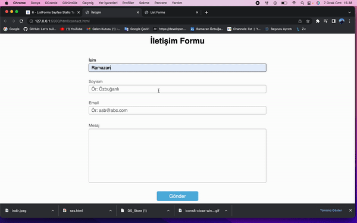

<h1>save database form</h1>

it will save incoming messages to database and see incoming messages from one page on another page to be answered still under development with html css javascript and data complement

